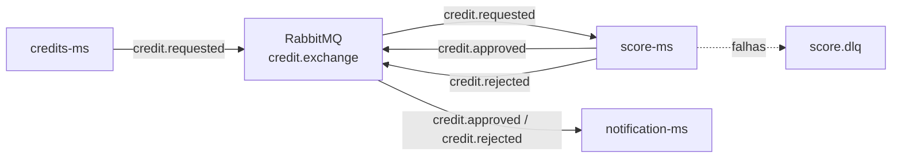

# score-ms


Microsserviço de análise de crédito criado com Spring Boot e RabbitMQ. O serviço faz parte de uma arquitetura orientada a eventos, consumindo solicitações de crédito, calculando um score simples e publicando a decisão de aprovação ou reprovação.

## Visão geral

O `score-ms` atua como consumidor e produtor dentro do fluxo de crédito:

1. Consome eventos `credit.requested` publicados pelo `credits-ms` no exchange `credit.exchange`.
2. Calcula uma pontuação com base em renda, valor solicitado e prazo.
3. Publica `credit.approved` quando o score é maior ou igual a `60`.
4. Publica `credit.rejected` quando o score é menor que `60`.
5. Repassa `name` e `email` nos eventos de resultado para permitir a notificação do solicitante.
6. Encaminha mensagens com falha para uma Dead Letter Queue.

## Decisão arquitetural

Na primeira versão, o `score-ms` foi projetado como um serviço stateless, sem banco de dados próprio.

Ele atua como um processador de eventos: consome `credit.requested`, calcula o score de forma determinística e publica `credit.approved` ou `credit.rejected`.

A decisão de manter o serviço sem persistência reduz a complexidade inicial e deixa o estado principal da solicitação concentrado no `credits-ms`.

Como o RabbitMQ trabalha com entrega at-least-once, eventos duplicados podem ocorrer. Nesta versão, duplicatas de resultado são tratadas no `credits-ms` pela máquina de estados da solicitação, que ignora eventos repetidos com o mesmo resultado e rejeita conflitos de estado.

## Arquitetura



## Tecnologias

| Tecnologia | Uso no projeto |
| --- | --- |
|  | Linguagem principal |
|  | Framework da aplicação |
|  | Integração com RabbitMQ |
|  | Exchange, filas, routing keys e DLQ |
|  | Build, dependências e testes |
|  | Redução de código repetitivo |

## Estrutura do projeto

```text
score-ms/
  pom.xml
  src/main/java/dev/mota/score_ms/
    config/
      RabbitMQConfig.java
    event/
      CreditRequestedEvent.java
      CreditApprovedEvent.java
      CreditRejectedEvent.java
    listener/
      CreditRequestedListener.java
    publisher/
      CreditDecisionPublisher.java
    service/
      CreditScoreService.java
  src/main/resources/
    application.properties
```

## Configuração do RabbitMQ

O serviço usa as seguintes configurações em `application.properties`:

```properties
spring.rabbitmq.host=localhost
spring.rabbitmq.port=5672
spring.rabbitmq.username=mota
spring.rabbitmq.password=1234
```

Recursos declarados pela aplicação:

| Tipo | Nome |
| --- | --- |
| Topic exchange | `credit.exchange` |
| Fila de entrada | `score.credit.requested.queue` |
| Routing key de entrada | `credit.requested` |
| Routing key de aprovação | `credit.approved` |
| Routing key de reprovação | `credit.rejected` |
| Dead letter exchange | `score.dlx` |
| Dead letter queue | `score.dlq` |
| Dead letter routing key | `score.dlq` |

## Regra de score

A pontuação máxima é `100` pontos:

| Critério | Pontos |
| --- | ---: |
| Renda maior ou igual a `5000.00` | 40 |
| Valor solicitado menor ou igual a 4x a renda | 25 |
| Prazo menor ou igual a 36 meses | 20 |
| Valor solicitado menor ou igual a 8x a renda | 15 |

Resultado:

- Score `>= 60`: publica `CreditApprovedEvent`.
- Score `< 60`: publica `CreditRejectedEvent`.

## Contratos de eventos

### Evento consumido

Routing key: `credit.requested`

```json
{
  "eventId": "b632c8c8-5ce2-4f4f-8f98-385c7c8f5a6f",
  "requestId": "8150262d-97b0-40f6-8f73-4c45e1f9c1c8",
  "cpf": "93541134780",
  "name": "Jose Mota",
  "email": "jose@email.com",
  "income": 6500.00,
  "valueRequest": 20000.00,
  "termMonths": 24,
  "correlationId": "c2cf0f79-71dd-4cc7-9e45-5d3bb4ea80f1",
  "occurredAt": "2026-07-08T10:00:00"
}
```

### Eventos publicados

Routing key: `credit.approved`

```json
{
  "eventId": "d57bc450-71b2-4655-a735-256d6429cc29",
  "requestId": "8150262d-97b0-40f6-8f73-4c45e1f9c1c8",
  "name": "Jose Mota",
  "email": "jose@email.com",
  "correlationId": "c2cf0f79-71dd-4cc7-9e45-5d3bb4ea80f1",
  "occurred": "2026-07-08T10:00:01"
}
```

Routing key: `credit.rejected`

```json
{
  "eventId": "14efc8dc-f138-49f0-b2b7-b065444387a7",
  "requestId": "8150262d-97b0-40f6-8f73-4c45e1f9c1c8",
  "name": "Jose Mota",
  "email": "jose@email.com",
  "correlationId": "c2cf0f79-71dd-4cc7-9e45-5d3bb4ea80f1",
  "occurred": "2026-07-08T10:00:01"
}
```

## Como executar

Entre na pasta da aplicação:

```bash
cd score-ms
```

Execute os testes:

```bash
./mvnw test
```

No Windows:

```bash
mvnw.cmd test
```

Suba a aplicação:

```bash
./mvnw spring-boot:run
```

No Windows:

```bash
mvnw.cmd spring-boot:run
```

A aplicação inicia na porta `8081`.

## Observações

- O serviço é stateless e não possui banco de dados próprio nesta primeira versão.
- O serviço depende de uma instância do RabbitMQ rodando localmente com usuário `mota` e senha `1234`.
- O modo de acknowledgement está configurado como `auto`.
- O retry do listener está habilitado com até 3 tentativas.
- Mensagens que falham após as tentativas podem ser direcionadas para a DLQ `score.dlq`.
